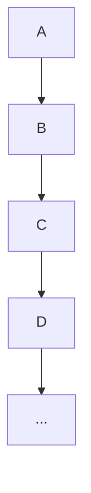

# Hashing Algorithms + Linear sorting

- menu
  - [Hash Algorihtm](#Hash)
    - [Definition](#What-is-Hashing)
    - [Approach to realising hash](#hash-function)
    - [Conclusion](#what-we-need-to-know-about-hash?)
  - [Linear Sorting](#Linear-Sorting)
    - [Counting Sort](#counting-sort)
    - [Radix Sort](#radix-sort)

## Hash

[External Link: What is Hashing Algorithm?](https://www.geeksforgeeks.org/introduction-to-hashing-2/)

### What is Hashing?

Hashing is a method of transforming the key to the value[^1] with a **hash function**. It enables fast retrieval of information based on its key. 
[^1]: The value is called **hash code**

The advantages for hashing is that when we intend to do search/insert/delete operation, the time complexity is $O(1)$. The execution time would be much lower in practice.

In python, there's a data structure "dict" work as hash table. Similarly, there's "unordered_map" in C++.



As is illustrated, A,B,C,D are the hash node, we want to transform the key to these code and store. 

### Hash Function

To avoid hash table degenerating into a linked list, could we come up with a hash function to uniformly spread the inputs?

NO!!! There no solution to address extremely anti-rule data!

However, to reach our "uniformly spreading" goal to the biggest extent, we could apply random distributing function. Furthermore, we could use (universal) hashing family to get more random outcomes.

Generally, we just apply mathematical functions or graphical reflection to get hash code.

### What we need to know about hash?

> This part is for those under the pressure of mid-term or final examination.

1. It's an encoding process.
2. The time complexity is so advantageous.
3. Its space complexity is relatively worse, requiring $O(nlog(m))$[^2]
[^2]: O(n) buckets; O(n) items with log(M) bits per item; O(log(M)) to store the hash function


## Linear Sorting 

[Recall to the sorting algorithm](https://github.com/EnjiXiong/Notes/blob/main/DSAA2043%20-%20Design%20and%20Analysis%20of%20Algorithm/Lecture%203%20-%20Recursion%20%2B%20Divide%20and%20Conquer.md)

The time complexity of the sorting algorithm we learn till now is $O(nlog(n))$ at best(such as merge sort and quick sort), could we do better job?

Theorem: Any deterministic comparison-based sorting algorithm must take Ω(n log(n)) steps.

Yes, we can!!!

### Counting sort

[External link: Three linear sorting algorithm - counting sort]((https://www.geeksforgeeks.org/counting-sort/)

1. Find the maximum number in the array, denoted as M
2. prepare a "counting array" whose size is M, storing the number of each element in the "counting array" from the array.
3. apply prefix sum method to handle the "counting array".
4. match the number in the previous array from the last with the key in the "counting array", and then minus 1.

| Advantage | Disadvantage |
|-----------|--------------|
| Stable, easy to code and $O(n)$ | Only effective for integers, Small scale array and require extra space |

```python
def count_sort(input_array):
    # Finding the maximum element of input_array.
    M = max(input_array)

    # Initializing count_array with 0
    count_array = [0] * (M + 1)

    # Mapping each element of input_array as an index of count_array
    for num in input_array:
        count_array[num] += 1

    # Calculating prefix sum at every index of count_array
    for i in range(1, M + 1):
        count_array[i] += count_array[i - 1]

    # Creating output_array from count_array
    output_array = [0] * len(input_array)

    for i in range(len(input_array) - 1, -1, -1):
        output_array[count_array[input_array[i]] - 1] = input_array[i]
        count_array[input_array[i]] -= 1

    return output_array

# Driver code
if __name__ == "__main__":
    # Input array
    input_array = [4, 3, 12, 1, 5, 5, 3, 9]

    # Output array
    output_array = count_sort(input_array)

    for num in output_array:
        print(num, end=" ")
```

### Radix Sort

[External link: Three linear sorting algorithm - radix sort](https://www.geeksforgeeks.org/radix-sort/)

1. Find the maximum element in the array, get its number of digits
2. compare the unit place digit one by one. Rule: 0 < NONE < normal order(1<2<3<...)

| Advantage |
|-----------|
| Stable |
| $O(n)$ |
| Can sort integers and strings |

| Disadvantage |
|--------------|
| No Floating numbers or other types are allowed |
| Significant amount of memory space is required |
| only suitable for data with fixed number of digits |

```python
# Python program for implementation of Radix Sort
# A function to do counting sort of arr[] according to
# the digit represented by exp.


def countingSort(arr, exp1):

    n = len(arr)

    # The output array elements that will have sorted arr
    output = [0] * (n)

    # initialize count array as 0
    count = [0] * (10)

    # Store count of occurrences in count[]
    for i in range(0, n):
        index = arr[i] // exp1
        count[index % 10] += 1

    # Change count[i] so that count[i] now contains actual
    # position of this digit in output array
    for i in range(1, 10):
        count[i] += count[i - 1]

    # Build the output array
    i = n - 1
    while i >= 0:
        index = arr[i] // exp1
        output[count[index % 10] - 1] = arr[i]
        count[index % 10] -= 1
        i -= 1

    # Copying the output array to arr[],
    # so that arr now contains sorted numbers
    i = 0
    for i in range(0, len(arr)):
        arr[i] = output[i]

# Method to do Radix Sort


def radixSort(arr):

    # Find the maximum number to know number of digits
    max1 = max(arr)

    # Do counting sort for every digit. Note that instead
    # of passing digit number, exp is passed. exp is 10^i
    # where i is current digit number
    exp = 1
    while max1 / exp >= 1:
        countingSort(arr, exp)
        exp *= 10


# Driver code
arr = [170, 45, 75, 90, 802, 24, 2, 66]

# Function Call
radixSort(arr)

for i in range(len(arr)):
    print(arr[i], end=" ")

# This code is contributed by Mohit Kumra
# Edited by Patrick Gallagher
```


Others: 

[External link: Three linear sorting algorithm - bucket sort](https://www.geeksforgeeks.org/bucket-sort-2/)
