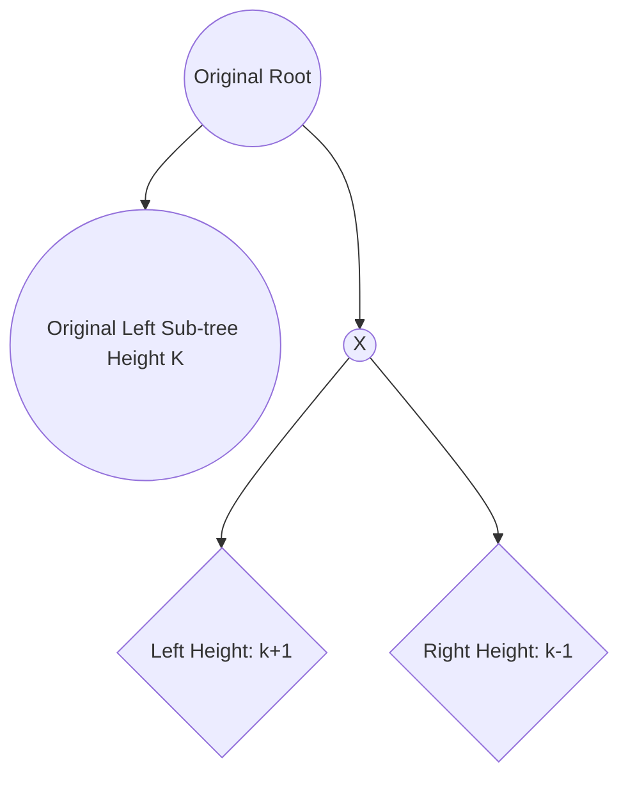
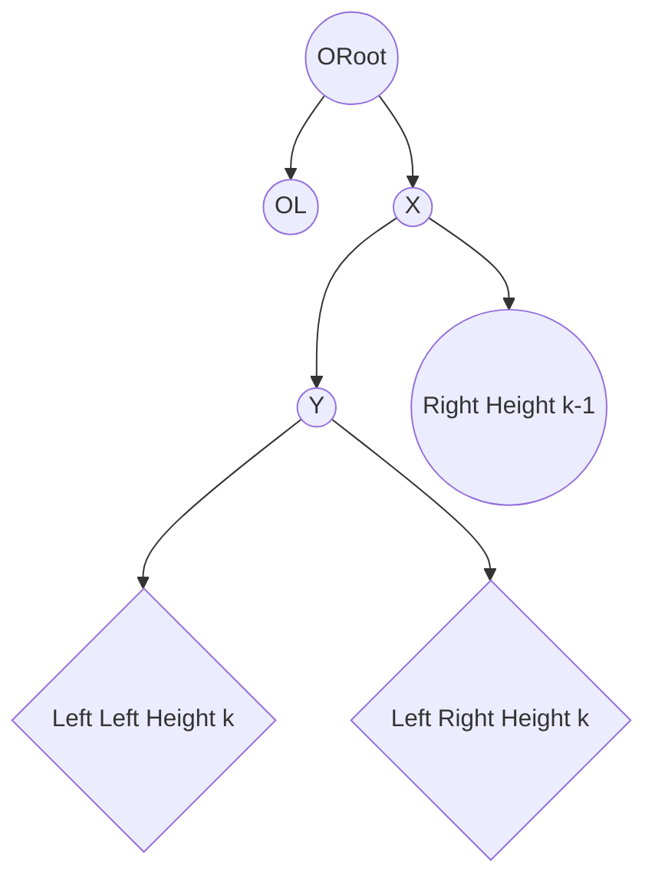
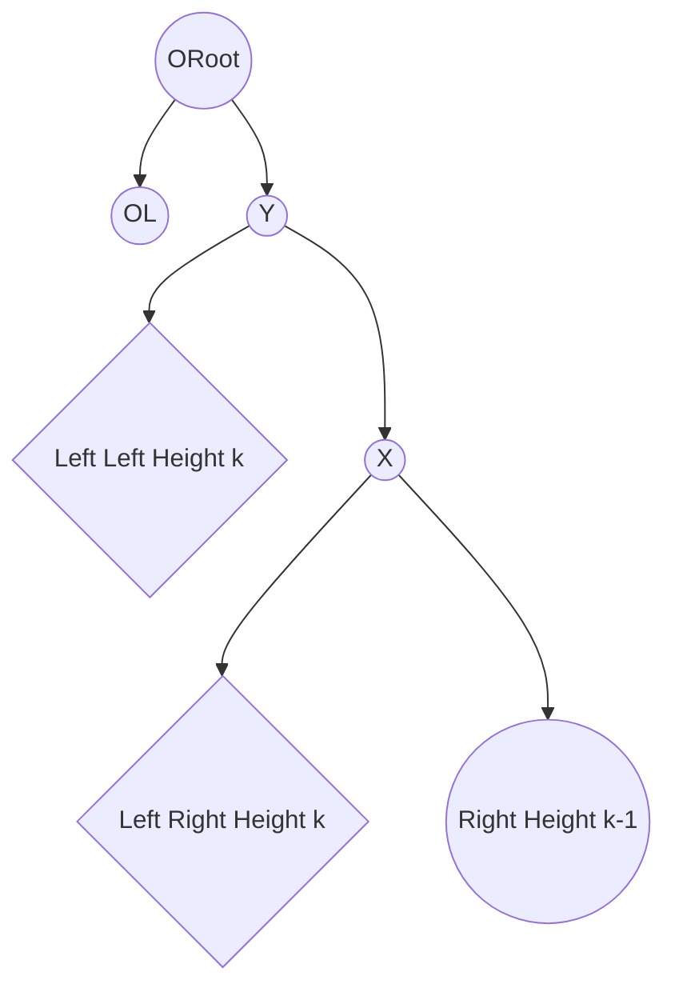
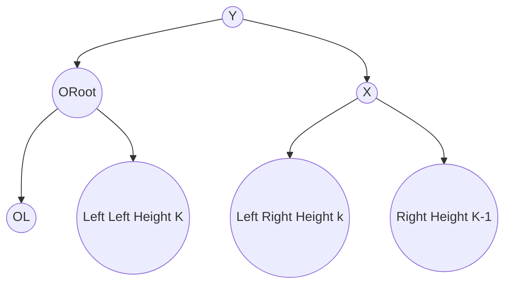
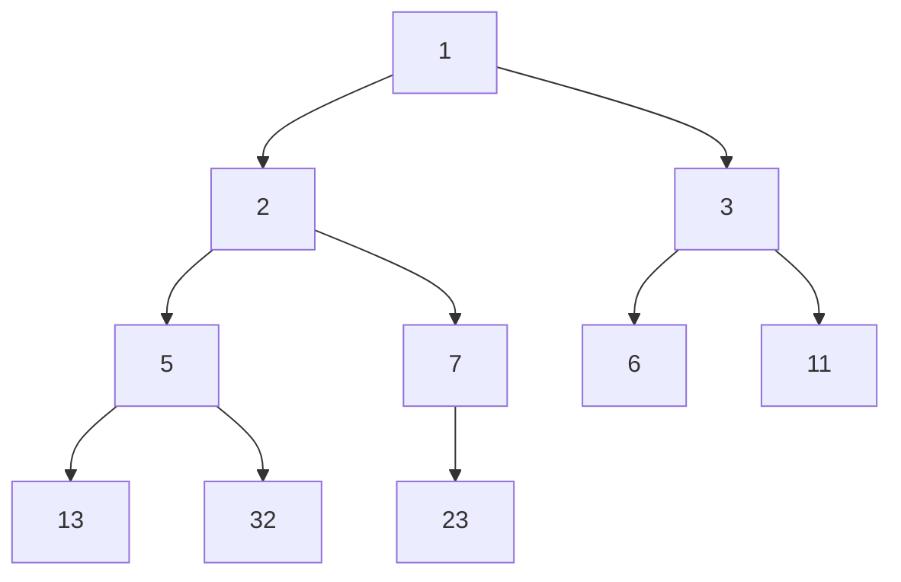

# Lecture 4 - Tree

> Knowledge in this lecture is difficult for me, that's why I insert numerous links into this note.
> From my perspective, it's easy to comprehend the concepts of the content, but how to implementing this data structure with the code is not easy.
> And the lecturer didn't concentrate on this factor.

## menu
- [Binary Search Tree](#binary-search-tree)
- [AVL Tree](#AVL-Tree)
  - [insertion](#insertion)
- [red black tree](#red-black-tree)
- [Binary Heap](#binary-heap)
- [Time Complexity Table](#time-complexity-table)

### binary-search-tree
> before we learn it recall the knowledge of [array and linked list](../Code/1st_lecture.ipynb).
> 
> The link is the relaative link in Enji Xiong's computer, so just see relative knowledge in your computer.

1. Definition: There's two children of every node, the left one is always smaller(or larger) than its father while the right is always larger(or smaller) than its father.
2. Property: Because we place values separately according to the relative relation, which means two different parts have completely different attributes, we usually store and search in this way.
3. Here is the detailed [explanation and animation](https://www.w3schools.com/dsa/dsa_data_binarysearchtrees.php)

```pyhton

class Node:
    def __init__(self, key):
        self.left = None
        self.right = None
        self.val = key

def insert(root, key):
    if root is None:
        return Node(key)
    else:
        if root.val < key:
            root.right = insert(root.right, key)
        else:
            root.left = insert(root.left, key)
    return root

def inorder_traversal(root):
    if root:
        inorder_traversal(root.left)
        print(root.val, end=' ')
        inorder_traversal(root.right)

def search(root, key):
    if root is None or root.val == key:
        return root

    if root.val < key:
        return search(root.right, key)

    return search(root.left, key)

# Search and insert is easy to implement, how to do with delete?
# Case 1: If we want to delete a leaf, just make its value none.
# Case 2: If the node has only one child, move the child to its father
# Case 3: If the node has two children, move the minimum node in the right sub-tree to the node.
def minValueNode(node):
    current = node
    # loop down to find the leftmost leaf
    while(current.left is not None):
        current = current.left 
    return current

def delete(root, key):
    # Base Case
    if root is None:
        return root
    
    # If the key to be deleted is smaller than the root's key then it lies in left subtree
    if key < root.val:
        root.left = delete(root.left, key)
    
    # If the key to be deleted is greater than the root's key then it lies in right subtree
    elif(key > root.val):
        root.right = delete(root.right, key)
    
    # If key is same as root's key, then this is the node to be deleted
    else:
        
        # Node with only one child or no child
        if root.left is None:
            temp = root.right
            root = None
            return temp
        elif root.right is None:
            temp = root.left
            root = None
            return temp
        
        # Node with two children: Get the inorder successor (smallest in the right subtree)
        temp = minValueNode(root.right)
        
        # Copy the inorder successor's content to this node
        root.val = temp.val
        
        # Delete the inorder successor
        root.right = delete(root.right, temp.val)
        
    return root


# Example usage
if __name__ == '__main__':
    r = Node(50)
    r = insert(r, 30)
    r = insert(r, 20)
    r = insert(r, 40)
    r = insert(r, 70)
    r = insert(r, 60)
    r = insert(r, 80)
    
    print("Inorder traversal of the initial tree")
    inorder_traversal(r)
    print("\nDeleting 20")
    r = delete(r, 20)
    print("Inorder traversal of the modified tree")
    inorder_traversal(r)
    print("\nDeleting 30")
    r = delete(r, 30)
    print("Inorder traversal of the modified tree")
    inorder_traversal(r)
    print("\nDeleting 50")
    r = delete(r, 50)
    print("Inorder traversal of the modified tree")
    inorder_traversal(r)
#output
Inorder traversal of the initial tree
20 30 40 50 60 70 80 
Deleting 20
Inorder traversal of the modified tree
30 40 50 60 70 80 
Deleting 30
Inorder traversal of the modified tree
40 50 60 70 80 
Deleting 50
Inorder traversal of the modified tree
40 60 70 80 

```

### AVL-Tree

1. definition: An AVL (Adelson-Velskii and Landis) tree is a binary search tree that also meets the following rule.
2. AVL condition: For every node, the height of its left subtree and right subtree differ by at most 1.

**Notation**: 

Height of a tree: Maximum number of edges on a path from the root to a leaf.

A tree with one node has height 0.

A null tree (no nodes) has height -1.

---

Let $n(h)$ be the number of nodes if the height of the tree is $h$. For $h >= 2$, we have 

$$
\begin{aligned}
n(h) & = n(h-1) + n(h-2) + 1 \\
     & > 2n(h-2) \\
     & > 4n(h-4) \\
     & > ... \\
     & > 2^{\frac{h}{2}} \\
\end{aligned}
$$

Thus, we can conclude that $h < 2logn(h)$, so $h = \theta(log(n))$

The most challengeable part for the AVL tree is the insertion. How to make random insertion a balanced structure?

The answer is rotating it!

[How does AVT tree rotate?](https://www.geeksforgeeks.org/introduction-to-avl-tree/)

#### insertion

1. Directly insert the element like BST(binary search tree)
2. Check if the balance is broken
3. If it's broken, left rotate if the right is heavier and right rotate is the left is heavier.
4. If it's still unbalanced after the rotation, just divide the initial larger unbalanced sub-tree and do the same.

Here's the model tree:


| Insertion Position | Rotation ways |
| ------------------ | ------------- |
| A | right rotation |
| B | left rotation -> right rotation |
| C | right rotation -> left rotation |
| D | left rotation |

***Example***

Take the situation C as an example, it looks like this initially:



The right sub-tree is out of balance, so we need to balance it first and then balance the whole tree.



And then right rotate the right sub-tree since it's left heavier.



In this stage, the right sub-tree is balanced. We just need to left rotate the whole tree to get all balanced.



Finally, we make it balanced again!

### red-black-tree

In the former example, I feel it difficult and complicated to rotate and return the balanced tree. There's a strict constraint of the AVL Tree, could we relax it a bit?

Now, red black tree is introduced: 

- Every node is colored red or black.
- The **root** node is a **black** node.
- **NIL** children count as **black** nodes.
- Children of a red node are black nodes. **(A red node definitely has exactly 2 black nodes as children)**
- For all nodes x:
  - **all paths** from x to NIL’s have the **same number of black nodes** on them.

Comparison with AVL Tree:

The AVL trees are more balanced compared to Red-Black Trees, but they may cause more rotations during insertion and deletion. So if your application involves frequent insertions and deletions, then Red-Black trees should be preferred. And if the insertions and deletions are less frequent and search is a more frequent operation, then AVL tree should be preferred over the Red-Black Tree.

The problem is still how to rotate it, because a new method to keep the balance is introduced -- re-color. [reference](https://www.geeksforgeeks.org/introduction-to-red-black-tree/)

*General Method:*

1. make the inserted value a new red node.
2. attempt to just change the color.
3. rotate the tree.
4. adjust the color.

### binary-heap

Binary heap is a binary tree but not a binary search tree. Child nodes are all larger or smaller than the former node. However, it's still complete, which means nodes are filled from the left to the right and from the root to the leaves. Like this:



We usually use Binary Heap to do these three operation: FindMin, DeleteMin, Insert. Just refer to the below link: 

[Binary Heap](https://www.geeksforgeeks.org/binary-heap/)

## Time Complexity Table

| | BST | AVL Tree | Red Black Tree | Binary Heap | Linked List | Array |
|-|-----|----------|----------------|-------------|-------------|-------|
| Search |
| FindMin |
| Delete |
| DeleteMin |
| Insert |
